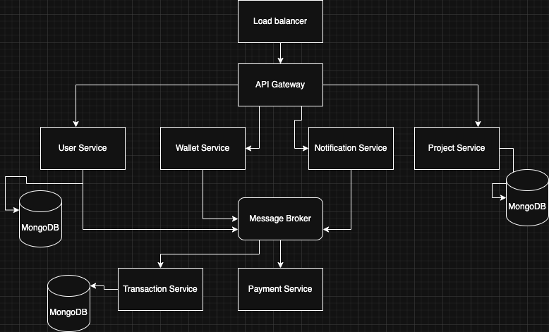

# Crowdfundr 

**Crowdfundr** is a modular and scalable crowdfunding platform built using Nodejs, following a microservices architecture. The system allows users to create campaigns, pledge funds, and receive notifications — all handled by independently deployed services.

---

##  System Design



##  Architecture Overview

Crowdfundr is designed with **ExpressJS microservices**, using **RabbitMQ** as the message broker for inter-service communication.


### Key Components:
- **Load Balancer:** Distributes incoming traffic across services.

- **API Gateway:** Central entry point that routes requests and handles authentication.

- **User Service:** Manages user accounts, roles, and authentication (JWT/OAuth).

- **Project Service:** Handles crowdfunding campaign creation and discovery.

- **Wallet Service:** Maintains user wallet balances and transaction records.

- **Payment Service:** Integrates with external gateways (e.g., Stripe) to process deposits and withdrawals.

- **Notification Service:** Sends event-driven emails/SMS.

- **RabbitMQ:** Message broker for asynchronous communication.

### Functional Highlights
- User registration, login & profile management

- Campaign creation & funding workflows

- Digital wallet linked to each user

- Secure payments via external gateways

- Email/SMS notifications on key actions

- Horizontal scaling of stateless services

- Asynchronous job handling via RabbitM

---

## 🛠 Tech Stack

| Layer       | Technology                    |
|-------------|-------------------------------|
| Backend     | ExpressJS                     |
| Communication | RabbitMQ (Microservices)    |
| Auth        | JWT                           |
| Mail        | Nodemailer, Mailtrap          |
| DBs         | MongoDB                       |
| DevOps      | Docker, Docker Compose, Github Actions |
| Monitoring  | Prometheus + Grafana, ELK Stack |

---

## 🗂️ Folder Structure

##  Getting Started

### 1. Clone the Repository

```bash
git clone https://github.com/psalmsin1759/crowdfund.git
cd crowdfund 
cd user-service
```

### 2. Install Dependencies
```bash
npm install
```

### 3. Example .env for the user service:
```bash
PORT=3001
JWT_SECRET=supersecret
MONGODB_URI=mongodb://localhost:27017/crowdfund_user
RABBITMQ_URL=amqp://localhost:5672
```

### 4. Run Service
```bash
# Gateway (API)
npm run dev 

# User Service
npm run dev 

# Project Service
npm run dev

# Payment Service
npm run dev

# Notification Service
npm run start:consumer

```

### Authentication Flow

 -   JWT is issued by the User Service

 -   Gateway validates token and forwards requests

 -   Microservices trust the authenticated payload via RabbitMQ context

 ### Testing

Each microservice supports unit and e2e testing using Jest:

```bash
npm run test
```